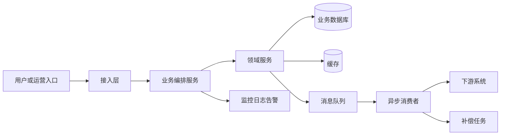
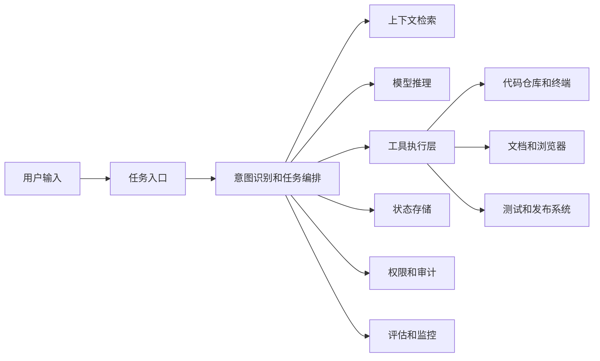

# 系统架构

## 面试定位

系统架构用来证明你不仅会写局部代码，还理解系统如何分层、如何协作、如何支撑业务目标。面试官关注的不是你能否画出复杂图，而是你能否讲清楚组件职责、数据流向、依赖边界、关键技术选择和风险控制。

对 Java 后端项目，架构表达要突出服务分层、领域模型、数据库、缓存、消息、RPC、任务调度、网关、监控和发布体系。对 AI Agent 项目，架构表达要突出入口层、任务编排层、模型层、工具层、上下文层、权限审计层、评估层和后端基础设施。

## 核心目标

- 让面试官快速理解系统全貌。
- 说明每个模块为什么存在，边界在哪里。
- 为后续核心链路、技术难点和方案权衡提供结构基础。
- 展示 Java 后端常见架构能力，例如分层、异步、缓存、一致性和可观测性。
- 展示 AI Agent 项目的工程化能力，而不是只展示模型调用。

## 准备要点

### 架构层次

建议从四层准备：

1. 接入层：网关、鉴权、限流、参数校验、协议转换。
2. 业务层：领域服务、策略计算、状态流转、任务编排。
3. 基础能力层：数据库、缓存、消息队列、搜索、对象存储、配置中心。
4. 治理层：监控、日志、告警、灰度、审计、补偿任务。

面试中不一定全部展开，但脑中要有完整图谱。

### 核心组件职责

每个组件至少能回答三个问题：

- 它负责什么。
- 它不负责什么。
- 它和上下游如何交互。

示例：

| 组件 | 负责 | 不负责 |
| --- | --- | --- |
| API 服务 | 参数校验、权限、业务编排、同步结果返回 | 不直接承担耗时下游批量处理 |
| 领域服务 | 业务规则、状态机、幂等控制 | 不处理 HTTP 协议细节 |
| MQ 消费者 | 异步履约、重试、削峰 | 不做用户即时强依赖响应 |
| 补偿任务 | 扫描异常状态、重试失败动作 | 不替代主链路幂等 |
| 缓存层 | 热点数据读取、配置快照、降级兜底 | 不作为唯一事实源 |
| 监控告警 | 暴露指标、发现异常、辅助定位 | 不直接修复业务错误 |

### 数据存储

Java 后端面试中，数据库和缓存一定会被追问。

需要准备：

- 主表和扩展表如何设计。
- 哪些字段是状态字段，哪些字段是幂等字段。
- 哪些字段需要索引，索引如何支撑查询。
- 是否有唯一键保证业务幂等。
- 是否使用 Redis 缓存配置、热点数据、分布式锁或计数。
- 数据一致性以数据库为准，还是缓存可作为降级快照。
- 历史数据、日志数据和实时业务数据是否分库分表或归档。

### 依赖关系

架构表达中要主动讲依赖。

常见依赖：

- 上游：用户入口、运营后台、任务系统、订单系统、网关。
- 下游：资产系统、库存系统、支付系统、风控系统、通知系统。
- 横向：配置中心、消息队列、缓存、日志、监控、数据仓库。
- AI Agent：大模型服务、向量检索、代码仓库、浏览器、终端、CI、文档系统、权限系统。

依赖不是越多越好。要讲清楚哪些依赖在核心链路，哪些可以异步，哪些有降级。

## 展开框架

### 总体架构模板



讲图时不要逐节点念，要讲主线：

```text
入口请求先经过网关和权限校验，核心业务逻辑在业务编排服务里完成。领域服务负责状态机、幂等和规则计算，数据库作为事实源，缓存用于热点配置和高频读取。对耗时或不稳定的下游调用，我们通过 MQ 异步化，由消费者处理履约和重试。整条链路通过 traceId、指标和补偿任务保证可观测和可恢复。
```

### Java 后端分层模板

```text
Controller：协议适配、参数校验、返回结构。
Application Service：用例编排、事务边界、调用领域服务。
Domain Service：业务规则、状态机、策略计算、幂等语义。
Repository/DAO：数据访问、索引查询、持久化。
Infrastructure：RPC、MQ、Redis、配置中心、监控。
Job/Consumer：异步任务、补偿、批处理。
```

可以强调：

- Controller 不堆业务逻辑。
- Service 层不直接散落 SQL 细节。
- 领域层表达业务规则。
- 基础设施层隔离第三方依赖。
- 异步消费者也要遵守幂等和状态推进。

### AI Agent 架构模板



讲法：

```text
Agent 架构里，大模型不是唯一核心。入口层负责接收任务和身份信息，编排层负责拆解步骤和控制状态，上下文层负责检索代码、文档和历史信息，工具层负责把模型决策转成受控执行。权限和审计保证敏感操作可追踪，评估层用任务成功率、工具成功率和人工采纳率衡量效果。
```

## 常见追问

### 为什么这样分层

回答重点：

- 分层是为了职责清晰和变化隔离。
- 不要只说「规范」。

示例：

```text
这样分层主要是为了隔离变化。入口协议可能变化，所以放在 Controller；业务流程会随着需求变化，所以由应用服务编排；真正稳定的业务规则沉到领域服务；数据库、缓存、RPC 和 MQ 属于基础设施，尽量通过接口隔离。这样后续如果新增入口、替换下游或调整存储，不会把核心业务规则打散。
```

### 为什么要异步

回答重点：

- 异步解决下游延迟、削峰、隔离和重试。
- 同时承认异步带来状态复杂度。

示例：

```text
异步化主要针对非强实时但容易受下游波动影响的部分。入口同步链路只保证请求被合法接收和状态正确落库，耗时的履约调用通过 MQ 执行。这样可以降低用户请求等待时间，也能通过队列削峰。代价是状态变成最终一致，所以我们补了状态机、幂等消费、失败重试和用户可查询的处理中状态。
```

### 缓存怎么保证一致性

回答重点：

- 说明缓存承担什么角色。
- 说明更新策略和兜底。

示例：

```text
我们把数据库作为事实源，缓存主要用于热点配置和高频查询。更新策略上，配置类数据采用发布后刷新或短 TTL，用户状态类数据尽量避免强依赖缓存写入成功。对一致性要求高的写链路，不以缓存作为最终判断依据，而是以数据库状态和唯一约束为准。缓存异常时可以降级到 DB 或使用本地快照。
```

### 架构里最大的单点是什么

回答重点：

- 主动识别风险。
- 说清楚降级或治理方案。

示例：

```text
最大的风险点是下游履约系统，因为它在高峰期延迟波动会影响整体完成时间。我们没有把它放在用户强同步链路里，而是通过 MQ 隔离；同时对消费者做限流和重试，对失败状态做补偿扫描，对下游错误码做分类处理。这样下游短时不可用时，入口仍能接收请求，用户看到的是处理中状态。
```

### Agent 架构中如何防止模型乱调用工具

回答重点：

- 工具层必须有后端约束。
- 不依赖 prompt 自觉。

示例：

```text
我们不把工具安全完全交给模型。模型只能输出结构化工具调用意图，真正执行前会经过后端工具 schema 校验、权限校验、参数白名单和敏感操作确认。执行结果会写入审计日志，失败会进入可恢复状态。对于写文件、提交代码、发布、删除等高风险动作，要么禁止自动执行，要么要求人工确认。
```

## 优秀回答结构

1. 先给全貌：系统由哪些层组成。
2. 再讲主链路：一次请求如何经过这些层。
3. 然后讲关键组件：数据库、缓存、MQ、下游依赖、监控。
4. 接着讲关键设计原因：为什么同步，为什么异步，为什么缓存，为什么拆服务。
5. 最后讲风险和治理：单点、降级、灰度、回滚、补偿、可观测性。

可复用模板：

```text
这个系统从架构上可以分成【接入层】、【业务编排层】、【领域能力层】和【基础设施层】。
主链路是【入口】进入后，经过【校验和编排】，核心状态落在【事实源】，非强实时动作通过【异步机制】处理。
数据库主要承载【核心状态】，缓存用于【热点读取或配置快照】，MQ 用于【削峰和解耦】，监控覆盖【接口、消息、下游和业务状态】。
这样设计的原因是【业务约束和技术权衡】，最大的风险点是【风险】，对应的治理手段是【治理】。
```

## 常见误区

- 架构图很复杂，但讲不出请求如何流转。
- 只罗列中间件，不讲组件职责。
- 把缓存、MQ、RPC 说成标配，而不是基于问题选择。
- 不知道数据库是事实源还是缓存是事实源。
- 不知道事务边界在哪里。
- 不知道失败后如何补偿。
- AI Agent 架构只画「用户到大模型」，没有工具层、权限层、状态层和评估层。
- 不主动讲风险，等面试官指出后被动解释。

## 自检清单

- 能否不用图也讲清楚系统分层。
- 能否画出一张主链路架构图。
- 能否说明每个组件负责什么、不负责什么。
- 能否讲清楚数据库、缓存、MQ 的使用原因。
- 能否说明同步和异步边界。
- 能否说清楚事务边界、幂等边界和失败补偿。
- 能否指出架构中最大的单点和治理方案。
- 能否把架构和业务目标连接起来。
- 如果是 AI Agent 项目，是否包含任务编排、工具执行、权限审计和评估监控。
